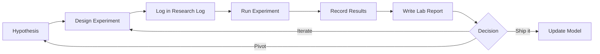

# Research Hub

Central hub for all AstroLLM research activity: experiments, lab reports, and decisions.

## Workflow

### 1. Before Running an Experiment

- Write the **hypothesis** first — what do you expect and why?
- Create a config YAML in `configs/` with all hyperparameters
- Add an entry to the [Research Log](../RESEARCH_LOG.md) with the `EXP-XXX` template
- Set up W&B tracking with a descriptive run name

### 2. During the Experiment

- Monitor loss curves, learning rate, GPU memory in W&B
- Note any unexpected behavior in the lab notebook
- If on a spot instance, verify checkpoints are being saved

### 3. After the Experiment

- Update the Research Log entry with results, observations, next steps
- Run the evaluation suite against the base model AND previous best
- Write a [Lab Report](../lab/index.md) if findings are significant
- Link the W&B run ID and commit hash for reproducibility

## Navigation

| Section | Purpose |
|---------|---------|
| [Research Log](../RESEARCH_LOG.md) | Chronological experiment entries (append-only) |
| [Experiments](experiments/index.md) | Detailed per-experiment reports with analysis |
| [Lab Reports](../lab/index.md) | Weekly observations, learnings, informal notes |

## Key Metrics We Track

### Model Quality
| Metric | What it measures | Target |
|--------|-----------------|--------|
| AstroMLab-1 | Astronomy knowledge (MCQ) | Base + 5-8 points |
| Grounding accuracy | Citation correctness | >80% |
| Tool routing F1 | Correct tool selection | >90% |
| Abstention recall | Says "I don't know" when appropriate | >70% |
| Pedagogy score | Explanation quality and depth | Qualitative improvement |

### Retrieval Quality
| Metric | What it measures |
|--------|-----------------|
| Recall@10 | Relevant papers in top 10 results |
| MRR | Mean reciprocal rank of first relevant result |
| nDCG | Normalized discounted cumulative gain |
| Object resolution accuracy | SIMBAD alias expansion correctness |

### Astronomy Error Taxonomy
Track from day one:

- **Citation errors**: wrong citation, right citation wrong synthesis, missed obvious paper
- **Object-identity errors**: alias confusion, host star vs planet, wrong counterpart
- **Unit-system errors**: cgs vs SI, magnitudes vs fluxes
- **Coordinate/epoch errors**: J2000 confusion, equatorial vs galactic
- **Catalog-semantic errors**: measured vs derived parameters
- **Literature-timeline errors**: citing superseded results as current
- **Tool errors**: should have called tool but didn't, or called unnecessarily
